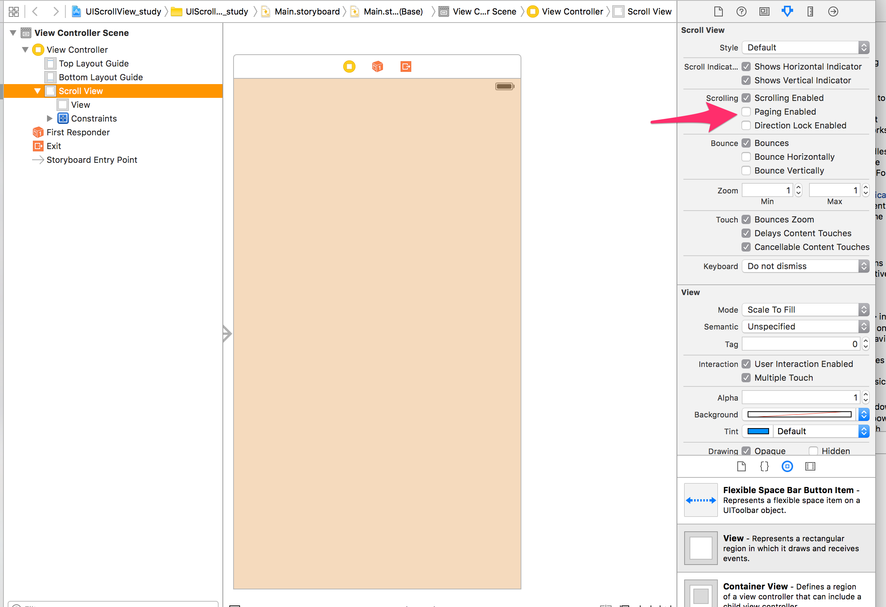

# ScrollViewをstoryboardだけで実装

## 手順
1. ViewController内にあらかじめ置いてある、Viewを削除し、ScrollViewを追加
2. ScrollViewには制約は特につけない
3. ScrollView内に、Viewを設置
4. Viewに制約を追加
  - ポイント
    - ScrollViewから上下左右の距離をすべて0に設定する
    - 上はデフォルトではScrollViewからの距離になっていないので、注意！
        
    - 下もデフォルトではScrollViewからの距離になっていないので、注意！
        
5. Viewを画面サイズ(ScrollView)より大きくすれば、スクロールできるようになる  
  - サンプルでは、Width = ScrollViewWidth*2, Height = ScrollViewHeight*3

#### 余談
スクロールをカルーセルのように一定区間で区切るようにしたい場合は  
ScrollViewのScrolling: Paging Enabled  
にチェックを入れる

参考:  
[【Swift】Scroll Viewの使い方。大きい部品をスクロールして見る](http://hajihaji-lemon.com/smartphone/swift/uiscrollview/)  

[Swiftスクロールビューで縦長画面の作成](http://qiita.com/kawasakiatsushi/items/2fdfbcdeff402edaf015)
